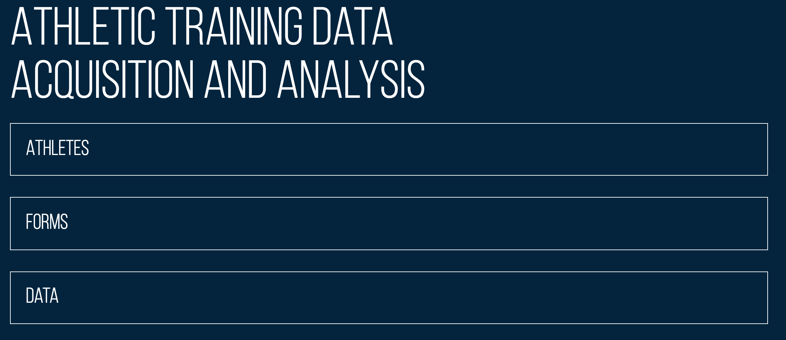

# ATHLETIC TRAINING DATA ACQUISITION AND ANALYSIS

This project is designed to aid in the survey of Athletic Training of Athletes of University of Evansville. 

## Prerequisites and Getting Started
* You need an internet connection and a link name to access the program. 
* The athletes get the link of the forms that need to be filled.
* Athletes are added by the administrator and they receive a notification automatically on failing to fill a form when they are required to.
* The administrator can see all the data that have been filled by Athletes and export them to spreadsheet if needed.

## Flow of the program

Main page

* Athletes
* List of athletes, can Add, View, Edit, and Delete
* Forms
* Morning Form
* Activity Form
* Data
* Morning Form Data
* Activity Form Data

## Team members
* Justin Banks
* Thomas Burger
* Duy Nhan Cao
* Graham Matthews
* Jenna Sumpter
* Darwin Yadav

## Acknowledgements
* Dr Deborah Hwang
* Troy Coppus 

